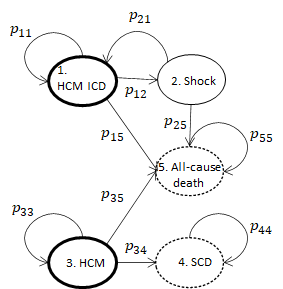

## Bayesian Models for CE Analysis of a Prognostic Model for Sudden Cardiac Death (SCD) in Hypertrophic Cardiomyopathy (HCM)

### Background

Hypertrophic cardiomyopathy(HCM) is a leading cause of sudden cardiac death (SCD) in young adults. Current risk algorithms provide only a crude estimate of risk and fail to account for the different effect size of individual risk factors.

### Aim

The aim of this study was to perform a cost-effectiveness analysis for the new SCD risk prediction model. See for more information:
[C O'Mahony (2014) A novel clinical risk prediction model for sudden cardiac death in hypertrophic cardiomyopathy (HCM risk-SCD). Eur Heart;35(30):2010-20.](https://pubmed.ncbi.nlm.nih.gov/24126876/)

### Overview

We develop a predictive model for assessing risk of SCD among patients with HCM.

-   Using individual level data generate posterior distribution samples of probabilities, costs and health values using WinBUGS
-   Simulate with a Markov model using the posterior samples as inputs
-   Compare outcomes for risk groups in terms of cost-effectiveness

The model structure consists of a decision tree component and a Markov model component. In effect this first model is represented by different cohorts of the data in the fitting process.

```{r fig.align="center", echo=FALSE, fig.cap="Markov model diagram. Bold circles represent starting states and dashed circles represent sink states."}

```

### Data

Individual HCM patient level data.

| Variable     | Description                                                                  |
---------------|-------------------------------------------------------------------------------
| set          | "Imputed dataset"                                                            |
| centre       | "Centre"                                                                     |
| id           | "ID"                                                                         |
| d            | "Censoring Indicator (1=SCD/ICD shock)"                                      |
| time         | "Time (years)"                                                               |
| age          | "Age (years)"                                                                |
| mwt          | "Maximal wall thickness (mm)"                                                |
| mwt2         | "mwt^2"                                                                      |
| la           | "Left atrial size (mm)"                                                      |
| maxlvotg     | "Maximal LVOT gradient (mmHg)"                                               |
| fhxscd       | "Family history of SCD"                                                      |
| nsvt         | "Non Sustained Ventricular Tachycardia"                                      |
| syncope      | "Syncope (blackout)"                                                         |
| na           | "Nelson-Aalen cumulative hazard"                                             |
| year         | "Year of entry in study"                                                     |
| male         | "Male"                                                                       |
| nyha3_4      | "NYHA class 3/4"                                                             |
| mye          | "Myectomy"                                                                   |
| mye_t0       | "Myectomy at baseline"                                                       |
| myedate      | "Myectomy date"                                                              |
| asa          | "Alcohol septal ablation"                                                    |
| asa_t0       | "ASA at baseline"                                                            |
| asadate      | "Date of ASA"                                                                |
| icd          | "Implantable Cardioverter defibrillator"                                     |
| icd_t0       | "ICD at baseline"                                                            |
| amio         | "Amiodarone"                                                                 |
| perm_persaf  | "Permanent or Persistent Atrial Fibrillation"                                |
| mwt30        | "MWT = or > 30mm"                                                            |
| lvedd        | "LV end diastolic dimension (mm)"                                            |
| fs           | "Fractional Shortening (%)"                                                  |
| lvoto30      | "LVOT gradient = or >30mmHg"                                                 |
| lvoto50      | "LVOT gradient = or >50mmHg"                                                 |
| t0           | "Date of baseline evaluation"                                                |
| tmax         | "Date of censoring or endpoint"                                              |
| yearend      | "Year exiting study"                                                         |
| fu           | "Follow-up period (years)"                                                   |
| scd          | "Sudden Cardiac Death"                                                       |
| scdtype      | "SCD type: 1= appropriate ICD shock, 2=survived cardiac arrest, 3=actual SCD"|
| cvs_all      | "All cardiovascular deaths combined"                                         |
| ccf_tx       | "Heart failure deaths and transplants"                                       |
| ccf          | "Heart failure deaths only"                                                  |
| tx           | "Transplants only"                                                           |
| cva          | "Stroke deaths"                                                              |
| cvs_other    | "Other cardiovascular deaths"                                                |
| non_cvs      | "Non cardiovascular deaths"                                                  |
| unknowndeath | "Unknown Deaths (grouped with non_cvs)"                                      |
| anyrip_tx    | "All deaths and transplants"                                                 |
| centre2      | "Centre"                                                                     |
| centre_cat1  | "centre2==Athens"                                                            |
| centre_cat2  | "centre2==Bologna"                                                           |
| centre_cat3  | "centre2==Coruna"                                                            |
| centre_cat4  | "centre2==London"                                                            |
| centre_cat5  | "centre2==Murcia"                                                            
| centre_cat6  | "centre2==Naples"   

## Workflow

The main files to perform the analysis are:

-   `prep_study_data.R` munges the raw data and save the input data in `data/`
-   `BUGS/script.R` runs the BUGS code in `BUGS/model.txt`
-   `main-ce-analysis.R` performs the cost-effectiveness analysis
-   `pop_counts_plot.R` creates output plots

