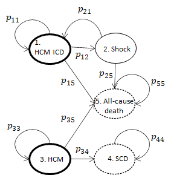

```{r setup, include=FALSE}
knitr::opts_chunk$set(echo = TRUE)
```

```{r, echo=FALSE}
data(list = params$data, package = "HCM.SCD.CEanalysis")
```

```{r echo=FALSE}
centre_tab <- dplyr::count(ipd_risk, centre)
centre <- centre_tab$centre
n <- centre_tab$n

cens_tab <- dplyr::count(ipd_risk, d)
cens <- cens_tab$d
nd <- cens_tab$n
```

# Introduction

Hypertrophic cardiomyopathy (HCM) is a common inherited heart
muscle disorder and a leading cause of sudden cardiac death (SCD)
in young adults. Patients at high risk of SCD need to be identified
so they can be offered lifesaving treatment with an implantable cardioverter
defibrillator (ICD). Contemporary guidelines recommend
that the sudden death risk is assessed by evaluating clinical
parameters that reflect the severity of the underlying myocardial
disease. The presence or absence of these risk factors is then used
to guide clinical decision-making with respect to prophylactic ICD
implantation. Although observational cohort studies show that
this approach identifies patients with the greatest risk of SCD, validation
of current algorithms suggests that they overestimate risk,
resulting in inappropriate prophylactic ICD implantation in a substantial
number of patients.
A previous study derived a new sudden death risk model that can be used to generate
individualized risk estimates for SCD and improve the targeting of
ICD therapy in patients with HCM [@OMahony2014].

This stated improvement was in terms of reducing the number of patients who are offered an ICD unnecessarily i.e. without a shock in their lifetime, or `false positives'.
However, this does not take into account a more detailed picture which would inform decision-making. The welfare or health impact on an individual of an ICD and the costs of various decisions and outcomes.

This is especially timely given new data on real world ICD practice which shows significant variation across healthcare systems [@Nauffal2021] and the rise of the s-ICD technology [@Lambiase2022].

This paper addresses the notable gap in the current literature.
We will present cost-effectiveness analyses according to a range of ICD implantation rates, reflecting differences in real world practice across geographies.
We will also highlight limitations to the health economic model and the fragility of conclusions drawn based on a range of sensitivity analyses.

All code is made publicly available on GitHub at www.github/n8thangreen/hcm_scd_cemodel/.

EDIT
“For primary prevention, the cost-effectiveness of ICD has been widely studied, but uncertainty about its cost-effectiveness remains. The cost-effectiveness ratios vary between studies depending on the patient characteristics, methodology, perspective, and national settings. Among the European studies, the conclusions are varied, where the ICD is considered cost-effective or not dependent on the study”

## Previous work
There have been previous cost-effectiveness analyses of ICD implants [@Magnusson2020; @Cowie2009;  @Mealing2016; @Smith2013]

[@Yao2007] use a Markov model and consider multiple implantation attempts if unsuccessful.
[@Colquitt2014] is a Health Technology Assessment which compares optimal pharmacological therapy (OPT) with or without ICD.
[@Tomini2016] is a review of economic evaluation models for cardiac resynchronization therapy with implantable cardioverter defibrillators in patients with heart failure.
[@Ommen2020] 2020 AHA/ACC Guideline for the Diagnosis and Treatment of Patients With Hypertrophic Cardiomyopathy.

[@OMahony2014] provided a systematic review and meta-analysis.
Using 7000 unselected patients with HCM from Europe, Asia, Middle East, North and South America, main findings support the 2014 ESC guideline recommendations for the primary prevention of SCD. Pooled prevalence of SCD endpoints was 1.0% (95% CI 0.52 to 1.61) in low-risk patients (<4% over 5 years), 2.43 (95% CI 1.23 to 3.92) in intermediate-risk patients (4-6% in 5 years)  and 8.39 (95% CI 6.68 to 10.25) in high-risk patients (>6% in 5 years).

Compared with data analyses of the same cohort [@Lorenzini2019] 
$N=4800$,  [hypertrophic cardiomyopathy outcome investigators cohort]
The main survival analysis was based on a composite end point consisting of all-cause mortality, aborted SCD, and heart transplant. After a median follow-up of 6.2 years (IQR, 3.1-9.8), 721 patients (14.7%) reached the composite study end point. 3.4% met the SCD or equivalent end point (SCD, 138 [2.8%]; aborted SCD, 30 [0.6%]); 2.2% died of other CV causes; 212 patients (4.3%) died of non-CV causes.

Main cause of death in younger patients was SCD (or equivalent), but this accounted for a progressively smaller percentage of total deaths with advancing age, whereas HF death or cardiac transplantation accounted for a similar proportion of events throughout the age spectrum. Female patients had higher excess mortality than male patients did (SMR, 2.66; 95% CI, 2.38-2.97 vs SMR, 1.68; 95% CI, 1.52-1.85; P < .001) and female sex was independently associated with a worse prognosis after adjusting for baseline differences in a multivariate model (hazard ratio, 1.28; 95% CI, 1.09-1.49; P = 0.003).


__Comparison with other models__
[@Magnusson2020] Of 1000 simulated patients, after 12 years, 402 lives were saved. 
QALYs were derived from the Swedish tariff of EQ5D-3L for people at age 50–75 years. It is assumed that people with HCM have lower utilities than in the general population (multiplied by 0.8).

[@Smith2013] Lifetime horizon, non HCM ICD cohort. Lifetime horizon but monthly cycles!
Netherlands registry used. They quote [@Sanders2005] for the 0.88 utility.


[@Cowie2009] ->
Non-HCM population. Mean age once more in late 50s. They modify Sanders model by incorporating Belgian life tables to adjust the non cardiac mortality rate, and define specific categories of death.

[@Mealing2016] ->
Lifetime horizon, Non HCM ICD cohort. Starting age 66. References NIHR [@Buxton2006]. Good supplemental appendix

[@Thijssen2014] – monthly cycle, lifetime horizon non HCM cohort.

[@Garcia-Perez2015] – Systematic review of cost effectiveness of ICD, of 18 studies identified for primarr prevention cohort, 7 purely ischaemic aetiology, others mixed. Overall v low HCM numbers. All 2010 and before.
[@Bryant2007] appears to be an older version of Garcia Perez

[@Caro2007] -> cost benefit analyses


# Data
The data set has been described in detail elsewhere (see [@OMahony2014]) so we will describe it briefly here.
The main data set contains $n$ = `r nrow(ipd_risk)` individuals follow-up data of patients with HCM who may have been given an ICD depending on clinical and patient factors.

Key cohort characteristics include the following. Patients were enrolled from the 6 health centres: `r paste0(centre[1], " (", n[1], ")")`, `r paste0(centre[2], " (", n[2], ")")`, `r paste0(centre[3], " (", n[3], ")")`, `r paste0(centre[4], " (", n[4], ")")`, `r paste0(centre[5], " (", n[5], ")")`, `r paste0(centre[6], " (", n[6], ")")`; The number of uncensored individuals was `r nd[2]` (`r 100*round(nd[2]/(nd[1]+nd[2]),2)`%); The mean age (sd) was `r round(mean(ipd_risk$age),0)`(`r round(sd(ipd_risk$age),0)`); The start of study data collection was in `r min(ipd_risk$year)` to `r max(ipd_risk$year)`. Further plots are given in the Appendix.

Health and cost data were obtained from literature and expert opinion.
Table 1 presents the unit cost and health values used in the model.

```{r results="asis", echo=FALSE}

tab <- cat(
"| Description                      | Parameter   | Value$^*$       | Range | Source           |
|----------------------------------|-------------|-----------------|-------|------------------|
| *Health*                         |             |                 |       |                  |
| HCM without ICD                  | `q_hcm`     | 0.88 QALY/year  |0.6, 1 | @Sanders2005     |
| Manage with ICD                  | `u_icd`     | 0.9             |0.8, 1 | @Magnusson2020; Holbrook2020     |
| Death                            | `q_death`   | 0 QALY/year     |       |                  |
| Implantation procedure utility   | `u_implant` | -0.048          |-0.096, 0| @Holbrook2020  |
| Shock utility                    | `u_shock`   | 0.875           |       | @Buxton2006      |
|                                  |             |                 |       |                  |
| *Cost*                           |             |                 |       |                  |
| ICD appointment                  | `c_appt`    | £145            |       | Cardiology Service (WF02A) Follow Up Attendance - Multi Professional. @NHSEngland2021 |
| Perform risk score               | `c_rs`      | £0              |       |                  |
| Implant ICD                      | `c_implant` | £4,666          |       | EY02B Tariffs    |
| Implant complication             | `c_compl`   | £28,857         |       | Formula derived  |
| Non-fatal shock with hospitalisation| `c_shock`| £22,880         |       | UK Stroke Assoc. |
| Lead infection                   | `c_inf`     | £37,116         |       | @Thijssen2014    |
| Lead dislodgement                | `c_dis`     | £6,146          |       | @Thijssen2014    |
| HCM without ICD                  | `c_hcm`     | 0               |       |                  |
| Sudden cardiac death (SCD)       | `c_scd`     | 0               |       |                  |
| All-cause death                  | `c_death`   | 0               |       |                  |
|                                  |             |                 |       |                  |
| *Probabilities*                  |             |                 |       |                  |
| Initial implant complication     | `p_compl`   | 0.043           |       | @Cunningham2012  |
| Lead infection                   | `p_inf_init`| 0.02277         |       | @Thijssen2014    |
| lead dislodgement                | `p_dis_init`| 0.00828         |       | @Thijssen2014    |
|                                  |             |                 |       |                  |
| Time horizon                     | `T`         | 12 years        |       |                  |
| Annual number of appointments    | `n_appt`    | 2               |       |                  |")

tab
```

: Model parameter values. All cost are in pounds sterling and inflated to 2021 value where necessary. $^*$either one-off/on state entry or recurring.


# Methods
<!-- add an arrow from state 3 going to state 1?
With age, more patients will move into the HCM ICD group. Some will also get a run of 'NSVT' which they survive and thus puts their risk score high enough to warrant an ICD. -->

The individual-level patient data are first stratified in to two groups for each risk algorithm.
The algorithms are ICD given if Cox model risk score \> 6% or \> 4%: Using the method from [@OMahony2014].

## Markov model

Th patient data provide starting state populations for HCM with ICD and HCM without ICD which will be different for each risk decision rule.
Further, the transition probabilities from these states will differ because of the case mixes.
We assume that shocked patients return to the HCM ICD state.
A diagram of the cohort model is given in Figure \@ref(fig:model).

```{r model, fig.align="center", echo=FALSE, fig.cap="HCM ICD Markov model diagram. Bold circles represent starting states with and without ICD and dashed circles represent sink states."}
# The dashed box indicates the state with an ICD inserted.
# 

```

Therefore, the transition matrix is the following.

$$
\begin{pmatrix}
p_{11} & p_{12} & 0 & 0 & p_{15}\\
1 - p_{15} & 0 & 0 & 0 & p_{15}\\
0 & 0 & p_{33} & p_{34} & p_{35}\\
0 & 0 & 0 & 1 & 0\\
0 & 0 & 0 & 0 & 1
\end{pmatrix}
$$

Model assumptions include the following:
We assumed that an ICD patient has 2 annual appointments.
All shocks are treated the same in terms of costs and health impact.
Implantation can have complications and the cost of an implant complication is taken as a weighted sum of infection and dislodgement cost with values from [@Smith2013].
The time horizon was set at 12 years from time of implant, following [@OMahony2014].
The life cycle duration was one year. This was a balance between temporal fidelity and parsimony and was appropriate given the scale at which events occur.
The full set of equations for calculating the health and cost values for each intervention are given in the Appendix.


## Transition probability inference

Using the statistical software for Bayesian analysis, WinBUGS [@Lunn2000] called from R [@R2021], each derived data set using each risk algorithm was used to generate posterior samples of transition probabilities.
Details of the formulae for the Bayesian inference is provided in the Appendix.


# Results

We give results of the model fitting and cost-effectiveness analysis.

## Model fitting

The data set was stratified in to two subgroups for each intervention. Table 2 gives the model starting state populations.
Uncertainty is presented for the Cox risk model values. These were obtained by using the frequentist confidence intervals from the risk score model fit in [@OMahony2014] and simulating a sample of risk scores for each individual. 
The proportion of individuals for the observed and Cox model 6% threshold are similar but this does not necessarily mean that they are the same case-mix.

| Risk rule       | State   | N (95\% CI) | Proportion (95\% CI) |
|-----------------|---------|------------|-------------
| Observed        | HCM ICD | 559        | `r round(559/(559+3113), 2)`  |
|                 | HCM     | 3113       | `r round(3113/(559+3113), 2)` | 
| Cox risk \>4%   | HCM ICD | 1103 (162, 2390)      | `r round(1103/(2569+1103), 2)` (0.04, 0.65)|
|                 | HCM     | 2569 (1282, 3510) | `r round(2569/(2569+1103), 2)` (0.35, 0.96)|
| Cox risk \>6%   | HCM ICD | 542 (61, 1777)       | `r round(542/(542+3130), 2)` (0.02, 0.48)|
|                 | HCM     | 3130 (1895, 3611) | `r round(3130/(542+3130), 2)` (0.52, 0.98)|

: Starting state populations by decision rule.

Figures \@ref(fig:transhist) gives densities of posterior distributions for state transition probabilities for groups with and without ICD implants using each risk decision rule.
We see that the chance of remaining in the HCM state is lower for the ICD patients selected using the 6% risk threshold rule relative to the current approach.
Also the chance of SCD or shock and all-cause death are higher. This indicates that the new method is better at selecting individuals to have an ICD.

```{r transhist, fig.align="center", echo=FALSE, out.width = "100%", fig.cap="Density curves of posterior distributions for state transition probabilities from the starting state. Red lines are for ICD patients and blue lines are for non-ICD patients. Each row is for a particular decision rule of 4\\% and 6\\% threshold Cox model risk score and the observed in the data set."}

```

```{r statepop, fig.align="center", echo=FALSE, fig.cap="State occupancy over time.", eval=FALSE}

```

```{r echo=FALSE}
load("../../data/bcea_data.RData")
n <- 3672
he$c <- -he$c
he$e <- -he$e
```

## Cost-effectiveness analysis

\newpage
| Strategy          | Cost, $c$ (£)                       | $\Delta c$ (£)                     | QALYs, $e$                          | $\Delta e$                         | ICER (£/QALY)                           |
|-------------------|-------------------------------------|------------------------------------|-------------------------------------|------------------------------------|-----------------------------------------|
| Baseline          | `r round(mean(he$c[, "obs"])/n,2)`  |                                    | `r round(mean(he$e[, "obs"]/n),2)`   |                                    |                                         |
| Cox \> 6%         | `r round(mean(he$c[, "risk6"])/n,2)`| `r round(mean(he$delta_c$risk6)/n,2)` | `r round(mean(he$e[, "risk6"])/n,2)` | `r round(mean(he$delta_e$risk6)/n,2)` | `r format(round(BCEA::tabulate_means(he)$ICER[1],0), digits=5, big.mark=",")` |
| Cox \> 4%         | `r format(round(mean(he$c[, "risk4"])/n,2), digits = 5, big.mark=",")`| `r round(mean(he$delta_c$risk4)/n,2)` | `r round(mean(he$e[, "risk4"])/n,2)` | `r round(mean(he$delta_e$risk4)/n,2)` | `r format(round(BCEA::tabulate_means(he)$ICER[2],0), digits=5, big.mark=",")` |

: Cost-effectiveness statistics per enrolled study individual. The baseline intervention is that observed in the data.

Table 3 shows the cost-effectiveness mean summary statistics for baseline intervention of that observed in the data.
We see that the 4\% risk threshold intervention is approximately double the baseline expected total cost.
This is expected because of the greater number of ICD patients.
The expected total QALYs are very similar between interventions so that the relative cost-effectiveness is driven by the total costs.
The 6\% risk threshold intervention is both cheaper than the baseline and has marginally better health outcomes. This is the most cost-effective option with an ICER of `r format(round(BCEA::tabulate_means(he)$ICER[2],0), digits=5, big.mark=",")`.
These conclusions are confirmed in the cost-effectiveness acceptability curve (CEAC) in Figure \@ref(fig:ceac) and the cost-effectiveness plane in Figure \@ref(fig:ceplane).

### Sensitivity analysis

| scenario| q_hcm| q_icd| u_icd| u_shock| c_shock| c_icd| c_rscore| c_appt|
|--------:|-----:|-----:|-----:|-------:|-------:|-----:|--------:|------:|
|        1|  0.88|  0.88| -0.05|    -0.5|   22880|  4666|        0|    145|
|        2|  0.50|  0.88| -0.05|    -0.5|   22880|  4666|        0|    145|
|        3|  1.00|  0.88| -0.05|    -0.5|   22880|  4666|        0|    145|
|        4|  0.88|  0.50| -0.05|    -0.5|   22880|  4666|        0|    145|
|        5|  0.88|  1.00| -0.05|    -0.5|   22880|  4666|        0|    145|
|        6|  0.88|  0.88| -0.05|    -0.8|   22880|  4666|        0|    145|
|        7|  0.88|  0.88| -0.05|    -0.2|   22880|  4666|        0|    145|
|        8|  1.00|  0.00|  0.00|     0.0|       0|     1|        0|      0|

: Sensitivity analysis input values.

  c_inf|    c_dis| p_compl|p_inf_init| p_dis_init|
------:|--------:|-------:|---------:|----------:|
7116.02| 6146.035|   0.047|   0.02277|    0.00828|
7116.02| 6146.035|   0.047|   0.02277|    0.00828|
7116.02| 6146.035|   0.047|   0.02277|    0.00828|
7116.02| 6146.035|   0.047|   0.02277|    0.00828|
7116.02| 6146.035|   0.047|   0.02277|    0.00828|
7116.02| 6146.035|   0.047|   0.02277|    0.00828|
7116.02| 6146.035|   0.047|   0.02277|    0.00828|
   0.00|    0.000|   0.000|   0.00000|    0.00000|
         
```{r ceac, fig.align="center", echo=FALSE, out.width = "60%", fig.cap="Cost-effectiveness acceptability curves (CEAC). Solid line is the 6\\% threshold Cox model and dashed line is the 4\\% threshold Cox model."}

```

```{r ceplane, fig.align="center", echo=FALSE, out.width = "60%", fig.cap="Cost-effectiveness planes. Black points are the 6\\% threshold Cox model and grey points are the 4\\% threshold Cox model. Mean values are indicated in red and a willingness to pay threhold for £25,000 is indicated with the diagonal line."}

```

## Discussion


<!-- shared decision-making -->

Decision making as to whether to have the implant is shared between patient and medical professional.
The SCD risk score is a support tool which contributes to the final decision.
An SCD risk score of 6% provides a treatment recommendation for one patient versus another.
There could be individual preferences that out-weighs the risk score and mean a patient chooses an alternative.
Risk is viewed differently in shared decision making between patients and clinicians (and also between different clinicians).

collective decision-making is aided by CEAs but shaped by local data -> price sensitive or QLY sensitive for each local population.
The main conundrum is that the tech offers delayed benefits for the few and an initial upfront cost however the final decision to implant is far more than a simple ‘economic calculation and much more ‘value based’/ individual preferencing. 

<!-- better QoL needed -->

Having more robust quality of life data will help to make such decisions.
more embedded PROMs research within other projects and systems.

Informatics Consult [@Lai2021] automation to scale evidence generation and to accelerate the return of results within clinical time-scales.

<!-- limitation -->

We did not include CRT-D or s-ICD but that can be overcome by sensitivity analyses that show e.g. the main message is that conclusions about the ICER etc will be robust to most departures from base assumptions other than tweaks in utility (which are the part of the model based on the weakest data!)

[@Olivotto2020] The role of new DMARDs and their ability to influence quality of life.
So if both ICD and non-ICD patients experience significant increases in QoL, are these equally distributed?

<!-- model building thinking -->
Although this paper is anticipate to be of most interest to an HTA panel, the process of formally describing the development of the Markov model over time, such as for example how many reimplantations and QoL impact and unknowns etc that that could result in may in turn aid decision making. 

<!-- future work -->
The nascent field of s-ICD in HCM would have a time horizons for battery replacement lower than assumed for our analysis.

We could easily include the option of a fuzzy decision boundary such that near the threshold there is some random variation as to whether a patient received an ICD or not.
Further this could formally incorporate expert knowledge which would require an elicitation exercise.

\newpage
# References

<div id="refs"></div>

\newpage
# Appendix
<!-- https://bookdown.org/yihui/rmarkdown-cookbook/bibliography.html -->

## Health and cost equations

Subscript $s$ denotes the state number and superscript denotes the intervention either ICD or not.

-   Annual health: \begin{align*} 
    e^i_{s=1}(t) &= q_{icd}, \;\; i = 1,2\\
    e^i_{s=3}(t) &= q_{hcm}, \;\; i = 1,2\\
    e^i_{s=2}(t) &= q_{hcm} - u_{shock}, \;\; i = 1,2\\
    e^i_{s}(t) &= 0, \;\;  i = 1,2, \; s = 4,5\\
    \end{align*}

-   Initial: \begin{align*}
    c^0_{s=1}(t = 0) &= c_{icd} + p_{compl} \times c_{compl}\\
    c^1_{s=1}(t = 0) &= c_{icd} + c_{rscore} + p_{compl} \times c_{compl}\\
    \end{align*} *should we include this?* $$
    e^i_{s=1}(t = 0) = q_{hcm} - u_{implant} - p_{compl} \times u_{compl}, \;\; i = 1,2
    $$

-   Annual cost: \begin{align*}
    c^i_{s=1}(t) &= 2 c_{appt}, \;\;  i = 1,2,\\
    c^i_{s=2}(t) &= c_{shock},  \;\; i = 1,2\\
    \end{align*}

## Bayesian inference of transition probabilities

Denote $x$ as the observed number of transitions, $p$ the probability of a transition and $n$ as the total number of transitions from a given state.
The hyperparameters $\alpha$ characterise the prior knowledge on $p$.
Superscripts indicate the decision rule used.

$$x^{(1)}_{i.} \sim \mbox{Multinomial}(p^{(1)}_{i.}, n^{(1)}_i), \;\; i = 1,3$$

$$x^{(2)}_{i.} \sim \mbox{Multinomial}(p^{(2)}_{i.}, n^{(2)}_i), \;\; i = 1,3$$

$$p^{(1)}_{i.} \sim \mbox{Dirichlet}(\boldsymbol{\alpha}^{(1)} ), \;\; i = 1,3$$

$$p^{(2)}_{i.} \sim \mbox{Dirichlet}(\boldsymbol{\alpha}^{(2)} ), \;\; i = 1,3$$

For all sink states,

$$
p^{(s)}_{ij} = \left\{
\begin{array}{ll}
1 & \mbox{if $i = j$};\\
0 & \mbox{if $i \neq j$}.
\end{array} \right.
$$

```{r, fig.align="left", echo=FALSE, out.width="50%", fig.show="hold", fig.cap="Markov model initial HCM without ICD state population histograms for 4% and 6% risk score threshold. The uncertainty on the risk score model fit is propogated to the stratification step. Red vertical lines indicate the sample averages taking into account risk score model uncertainty and the blue vertical lines indicate the point estimates direct from the data. The smoothed densities are shown with the red curves."}


```

